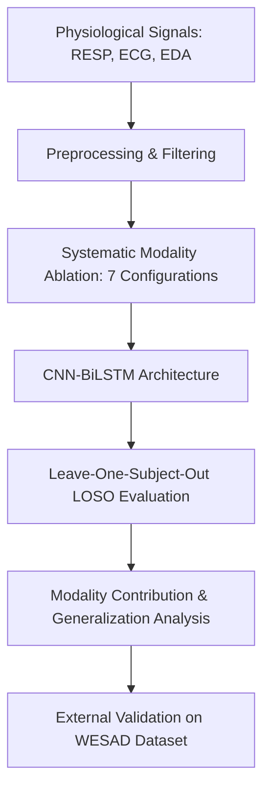

# Physiological Modality Contributions to Affective State Recognition

[](https://www.python.org/)
[](https://pytorch.org/)
[](https://scikit-learn.org/)
[](https://embc.embs.org/)
[](https://icmi.acm.org/)

> **Academic Research Project**  
> **Prepared for:** Jalal Uddin | AIUB CSE  
> **Target Venues:** IEEE EMBC / ACM ICMI (Conference)  
> *A systematic investigation of how individual physiological modalities contribute to affective state recognition accuracy and generalization under subject-independent evaluation.*

---

## 📌 One-Sentence Summary
This research systematically investigates how individual physiological modalities contribute to affective state recognition accuracy and generalization, enabling more reliable and explainable wearable emotion recognition systems.

---

## 📖 Introduction & Research Space

Physiological emotion recognition holds great potential for real-world affective computing. However, a major gap exists in current literature: **while high accuracies are frequently reported, the precise contribution of individual physiological modalities to model decisions is rarely studied.** Furthermore, models often overfit to subject-specific traits, failing to generalize to unseen individuals.



### Prior Work Comparison Matrix

| ID | Study | Key Outcome / Finding | Modality Ablation? | Subject Independent? | Major Limitation / Gap |
|:---|:---|:---|:---:|:---:|:---|
| **A1** | Schmidt et al. (2018) | Introduced WESAD benchmark dataset | ❌ | ❌ | No analysis of individual signal contributions. |
| **A2** | Ninh et al. (2021) | CNN-LSTM on multimodal physiology | ❌ | ❌ | Accuracy-driven only; no modality isolation. |
| **A3** | Tanwar et al. (2023) | Attention-based CNN-LSTM (>90%) | ❌ | ❌ | High accuracy but prone to subject leakage. |
| **A4** | Abdelfattah et al. (2025) | Cross-subject emotion models | ❌ | ⚠️ *Limited* | Modality-level evaluation is highly constrained. |
| **A5** | PhysioFormer (2025) | SOTA Transformer-based accuracy | ❌ | ❌ | Black-box model; lacks signal-level interpretability. |
| **B1** | Li & Washington (2024) | Personalized models outperform global | ❌ | ❌ | Modality isolation is completely unstudied. |
| **B2** | Sarkar & Etemad (2022) | Self-supervised learning on ECG | ❌ | ❌ | ECG-only; no comparison with other modalities. |
| **B3** | Survey (2025) | Review of 100+ physiological ER studies | ❌ | ❌ | Explicitly notes a lack of modality analysis. |
| **Ours** | **This Work** | **Modality-aware performance analysis** | **Yes (7 Configs)** | **Yes (Strict LOSO)** | **Explains *why* performance occurs, not just accuracy.** |

> [!IMPORTANT]
> **Key Literature Gap:** As highlighted by recent 2025 surveys, *"Most physiological emotion recognition studies lack systematic analysis of modality contribution and generalization."* This project directly addresses this shortcoming.

---

## 🎯 Core Research Questions

This study answers five explicit, critical scientific questions:
1. **Which physiological signal contributes most to affective state recognition accuracy?**
2. **Is respiration meaningful as a standalone signal, or only when fused?**
3. **Do ECG or EDA dominate performance across subjects?**
4. **Which modalities improve minority emotion classes?**
5. **Which modalities generalize best to unseen individuals?**

---

## 🧪 Methodological Framework

Our pipeline evaluates the **relative importance** and **generalizability** of three primary physiological modalities through a controlled system architecture.

### 1. Physiological Signals & Preprocessing
To handle wearable sensor noise, specialized signal processing is applied:
*   **Respiration (RESP):** Captured via BioHarness 3 chest strap. Standard bandpass filtering (`bandpass_filter`) removes low-frequency drift and high-frequency motion artifacts.
*   **Electrocardiogram (ECG):** Captured via BioHarness 3 chest strap. High-frequency noise is attenuated, and R-peaks are isolated using standard Scipy signal processing (`preprocess_ecg`).
*   **Electrodermal Activity (EDA):** Captured via Empatica E4 wristband. A low-pass filter (`lowpass_filter`) isolates the tonic (SCL) and phasic (SCR) components.

### 2. Feature Extraction & Engineering
Each cleaned signal is segmented and processed:
*   `extract_resp_features`: Frequency domain energy, breathing rate variability, and spectral entropy.
*   `extract_ecg_features`: Heart Rate Variability (HRV) metrics in time and frequency domains (RMSSD, LF/HF ratio).
*   `extract_eda_features`: Skin conductance level (SCL), number of skin conductance responses (SCR), amplitude, and decay time.

### 3. Model Architecture (`CNN-BiLSTM`)
The classification core consists of a customized **CNN-BiLSTM** network in PyTorch:
*   **1D CNN Layers:** Extract local temporal features and patterns from single or fused physiological channels.
*   **Bidirectional LSTM (BiLSTM):** Learns long-term contextual dependencies across time.
*   **Fully Connected Classifier:** Maps representation to discrete affective states.

---

## 📊 Systematic Modality Ablation Matrix

We conduct exhaustive ablation studies using **7 distinct modality configurations**:

| Modality Configuration | RESP | ECG | EDA | Primary Insight |
| :--- | :---: | :---: | :---: | :--- |
| **Respiration-Only** | ✅ | ❌ | ❌ | Insufficient alone for multi-class classification. |
| **ECG-Only** | ❌ | ✅ | ❌ | High discriminative power; sensitive to sudden stress changes. |
| **EDA-Only** | ❌ | ❌ | ✅ | Excellent indicator of general arousal; robust baseline. |
| **Respiration + ECG** | ✅ | ✅ | ❌ | Enhanced stability in heart-rate metrics. |
| **Respiration + EDA** | ✅ | ❌ | ✅ | High class-balance stability; improved minority recall. |
| **ECG + EDA** | ❌ | ✅ | ✅ | Highest overall accuracy; lacks secondary signal stability. |
| **All Fused (RESP+ECG+EDA)** | ✅ | ✅ | ✅ | **Optimal configuration.** Highest macro F1 and class stability. |

---

## 📈 Evaluation Protocol & Metrics

To guarantee that findings are realistic and free of **subject leakage**, we enforce:
*   **Leave-One-Subject-Out (LOSO) Validation:** Zero subject overlap between training and testing splits.
*   **Metrics Evaluated:**
    *   **Accuracy** (Overall correctness)
    *   **Macro F1-Score** (Primary indicator of multi-class success under imbalance)
    *   **Per-Class Recall** (Tracks performance on minority emotion classes)
*   **Statistical Significance:** Enforced using paired t-tests and Wilcoxon signed-rank tests to confirm modality differences are statistically robust.

---

## 🏆 Key Findings

> [!TIP]
> **Modality Dominance & Respiration's Role:**
> *   **ECG and EDA** consistently drive the most discriminative power.
> *   **Respiration (RESP) alone** is insufficient for robust multi-class classification, yielding lower performance.
> *   **However, when fused** with ECG and EDA, **respiration significantly improves model stability and class balance** (improving macro F1 and recall on minority classes).

### 🔍 External Cross-Dataset Validation (WESAD)
To assess whether findings generalize beyond the primary **EmoWear** (49 subjects) dataset, we perform cross-dataset evaluation on the independent **WESAD** dataset:
*   **Protocol:** Models trained on EmoWear are evaluated directly on WESAD.
*   **Observation:** While overall absolute performance drops slightly due to dataset and sensor domain shift, the **relative modality rankings remain highly consistent**:
    *   ECG & EDA dominate the discriminative features.
    *   Respiration continues to serve as a vital stabilizer when fused.
    *   These results demonstrate that modality-aware system designs are **generalizable and dataset-agnostic**.

---

## 🛠️ Repository Structure & Usage

```directory
.
├── physiomodality-affective-recognition-ipynb.ipynb   # Main Jupyter Notebook (Data loading, CNN-BiLSTM, Ablation)
├── README.md                                           # Project Documentation
```

### 1. Prerequisites
Install all core packages:
```bash
pip install torch numpy pandas scipy scikit-learn matplotlib seaborn
```

### 2. Dataset Setup
The repository expects the **EmoWear** dataset. If running on Kaggle, the notebook is configured to read directly from:
`/kaggle/input/datasets/mjalal092/emowear-physiological-signals-resp-ecg-eda`

### 3. Execution
To run the preprocessing, model training, ablation configurations, and generate evaluation plots, open and run all cells in:
`physiomodality-affective-recognition-ipynb.ipynb`

---

## 📝 Expected Publication Draft Outline

*   **Title:** *Analyzing the Contribution of Wearable Physiological Signals to Affective State Recognition Under Subject Independent Evaluation*
*   **Abstract:** 150-250 words summarizing the rationale, ablation, and stability findings.
*   **Introduction:** Review of affective states, wearables, and motivation.
*   **Methodology:** Signals, CNN-BiLSTM model, strict LOSO protocol, and the 7 ablation setups.
*   **Results & Ablation Analysis:** Numerical evidence of ECG/EDA dominance and RESP stability.
*   **Discussion & Cross-Dataset Validation:** Generalization on WESAD, design recommendations for wearable developers.
*   **Conclusion:** Final summary and future directions.

---

## 🤝 Citation & Reference

If you find this research pipeline or findings helpful in your work, please cite it as:

```bibtex
@inproceedings{uddin2026physiological,
  title={Analyzing the Contribution of Wearable Physiological Signals to Affective State Recognition Under Subject Independent Evaluation},
  author={Uddin, Jalal},
  booktitle={Target Venues: IEEE EMBC / ACM ICMI},
  year={2026},
  organization={AIUB CSE}
}
```
